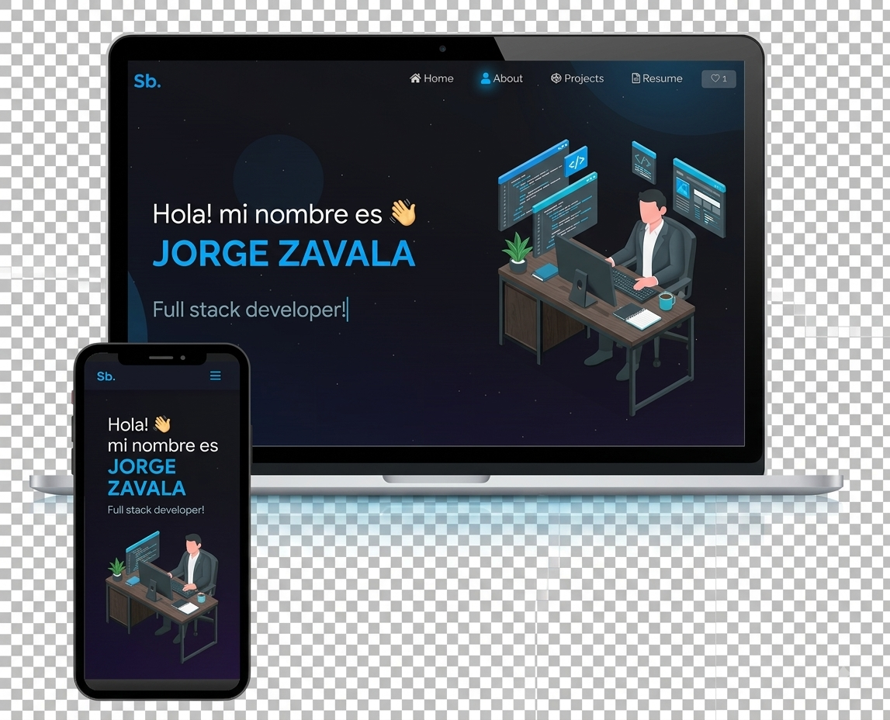

<h2 align="center">
  Portfolio  
</h2>

  

 

Tecnologías utilizadas

Este proyecto fue desarrollado utilizando las siguientes tecnologías:

React.js
Node.js
Express.js
CSS3
VS Code
Vercel
Características

📖 Diseño multipágina

🎨 Estilos con React-Bootstrap y CSS, con colores fáciles de personalizar

📱 Diseño totalmente responsive

Primeros pasos

Clona este repositorio. Necesitarás tener Node.js y Git instalados globalmente en tu máquina.

🛠 Instrucciones de instalación y configuración
Instala las dependencias:

npm install

En el directorio del proyecto, puedes ejecutar:

npm start

La aplicación se ejecutará en modo de desarrollo.

Abre http://localhost:3000 en tu navegador para visualizarla.

La página se actualizará automáticamente cada vez que realices cambios.

Instrucciones de uso

Abre la carpeta del proyecto y dirígete a /src/components/.

Allí encontrarás todos los componentes utilizados en el proyecto, donde podrás editar la información según tus necesidades.